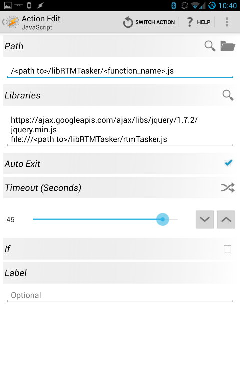

libRTMTasker
============

Library to allow Tasker to access and manipulate tasks in Remember the Milk

This library allows [Tasker][] to interact with the [RTM][] online todo list manager.   
Using this library you can create and complete tasks, as well as interact with them in
various ways.   

Prerequisites
-------------

The following steps are required in order to use libRTMTasker.

1. You must get an api key from [RTM][] see here [RTM API][]
2. In Tasker, set the global variable `RTM_API_KEY` to the key value you recieved.
3. In Tasker, set the global variable `RTM_SECRET` to the secret value you recieved
   with your key.

First Use
---------

[RTM][] requires that you provide a token with each request.  libRTMTasker handles 
that for you, however, you do need to authenticate your API KEY and generate a token first.
This is a two step process that only needs to be done once (per device):

1. Create a task with a javascript action that looks like this: 
   
   * Replace \<path_to\> with whatever folder you've downloaded the library to
   * Notice that in the "Path" field the value provided is just a local path
     whereas in the "Libraries" field the values provided are full URIs.
   * I would *strongly* recommend that you download the jQuery library to your
     device.  Every function in libRTMTasker requires it, and downloading it
     will save you considerable time.
2. When you run the above task, it will open a browser window, and ask you to
   log into [RTM][].  This will authenticate your API KEY.  
   * If you don't log in succesfully on the first try, [RTM][] does not preserve the
     validation request.  You will need to go back and run the above task again rather
     then simply attempting to log in a second time.
3. Create and run a task with a javascript action that looks like this:
   
   * This will get a token from [RTM][] and store it in Tasker. 
4. That's it! You are now ready to use the library.

Usage
-----

Each action provided by the library has an acompanying javascript file.   In general,
to use an action, you set some variables (described in "Required" and "Optional" in 
the docs below), and then execute a javascript action similar to this: 
.   
Once that action has completed, it will set a variable (described in "Provides" below)
that is then available to the rest of your tasker Task.   

In the event of an error, the %rtm_error variable is set with information.

Available Functions
-------------------

### rtmGetTasks
Provides a list of tasks that conform to the filter provided.
If no filter is provided the default is:

`list:inbox AND status:incompleted AND dueBefore:tomorrow`

**Optional**:  
  %filter - The filter to use when requesting tasks from [RTM][]  
**Requires**
  none
**Provides**: 
  %tasks - An array containing the tasks found.  Tasker doesn't support 
          multi-demensional arrays, so each task is encoded as a pipe (|)
          delimited string in the following order:

          id | name* | tags | # of notes | completed | priority | url* | 
          postponed | estimate | location_id | due | created | modified 

\* these items are returned in url-encoded format.  Use taskers "convert"
   functionality to decode them.

### rtmGetLists
Provides a list of Lists available in RTM.
This only returns active, non-smart, non-deleted lists.

**Optional**
  none
**Required**
  none
**Provides**
  %lists - An array of lists names.  Tasker doesn't support multi-dimensional
           arrays, so each list is a pipe (|) delimited string in the following
           order:
           
           id | name

### rtmAddTask
Adds a task to RTM using SmartAdd format.  See here: [RTM SmartAdd][]

**Optional**
  none
**Required**
  %newtask - A string, in SmartAdd format, containing a task to add to [RTM][]
**Provides**
  %newtask_id - the ID of the task that was added

### rtmCompleteTask
Marks a task "Complete"

**Optional**
  none
**Required**
  %task_id - the ID of the task to mark completed
**Provides**
  %completed_id - the ID of the task [RTM][] marked completed (should usually match %task_id)

### rtmUncompleteTask
Marks a task "incomplete"

**Optional**
  none
**Required**
  %task_id - the ID of the task to mark completed
**Provides**
  %uncompleted_id - the ID of the task [RTM][] marked incompleted (should usually match %task_id)

Advanced
--------
If you are comfortable with javascript, and prefer to use libRTMTasker in a scriptlet action, 
take a look at the rtmTasker.js file.   It contains documentation on the functions that are
available to you in that environment.  Note, however, that unless you are very familiar with
exactly how Tasker manages javascript variables, you may have trouble retrieving variables
set in your javascriptlet for use in the rest of your task.  This is especially true since
this library already strains Taskers javascript compatibility in several ways.  

Todo
----

This library is not yet complete the following is a partial list of features to come:

* Allow interaction with notes associated with tasks
* Create functions for editing various task properties after creation

 

[Tasker]: http://tasker.dinglisch.net "Tasker"
[RTM]: http://www.rememberthemilk.com "Remember the Milk"
[RTM API]: https://www.rememberthemilk.com/services/api/keys.rtm "RTM Api Key"
[RTM SmartAdd]: http://www.rememberthemilk.com/help/?ctx=basics.smartadd.howdoiuse "RTM Smart Add"
